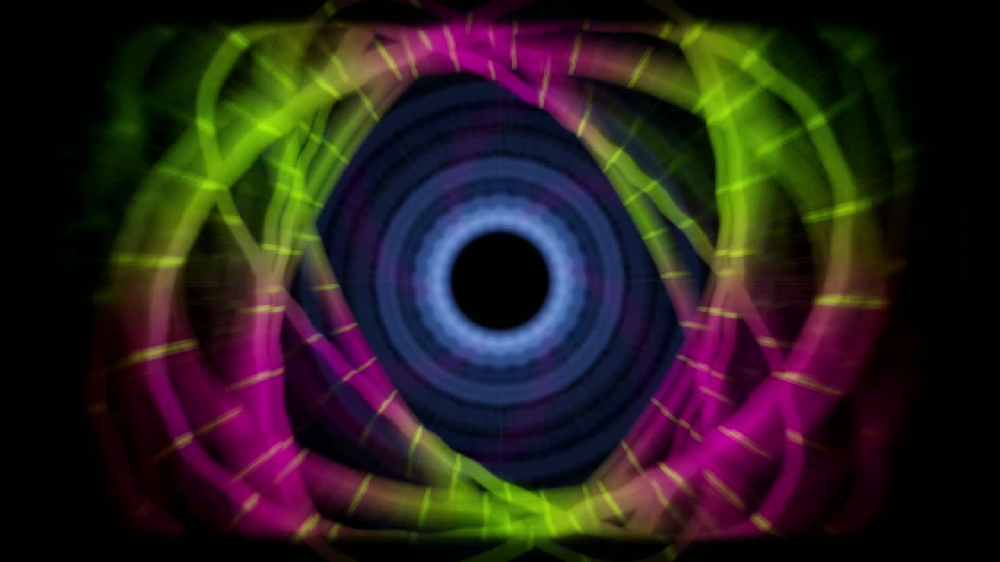
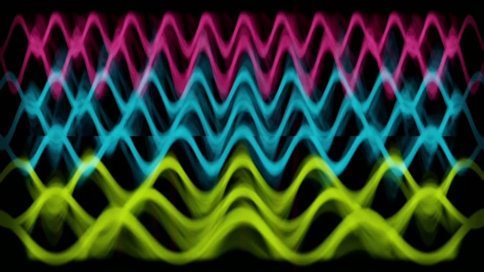
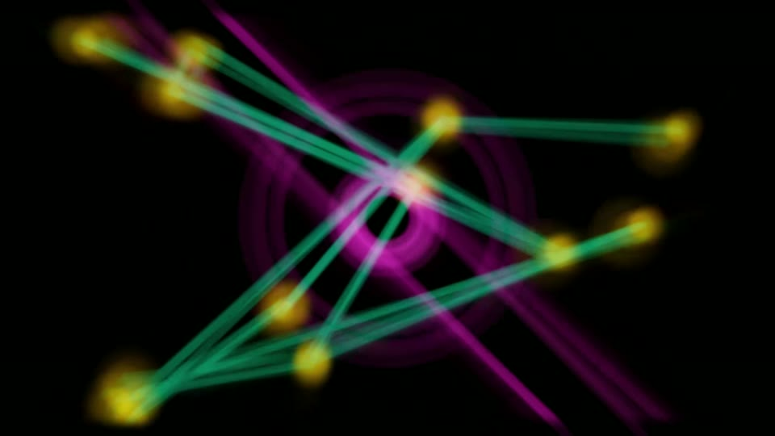
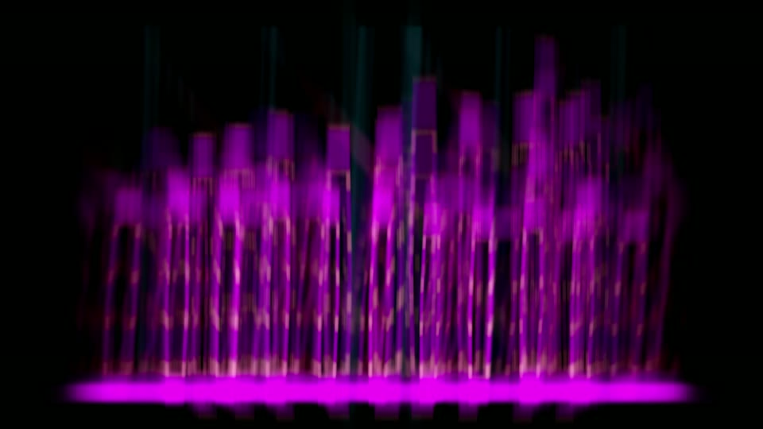
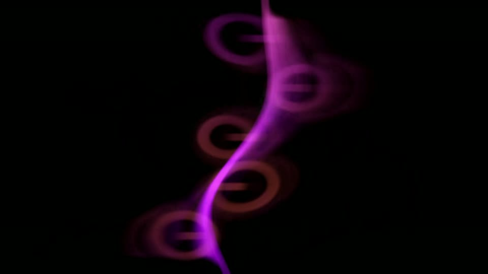

# Omadrop

<p align="center">
  <a href="https://github.com/btsouth/omadrop/releases/download/v0.3.0/omadrop-v0.3.0-demo.mp4">
    
  </a>
</p>

<p align="center"><strong>Music, rendered live.</strong></p>

Omadrop is a native music visualizer for Omarchy. It turns the audio playing
through PipeWire into ten original GPU feedback scenes. Kicks, snares, hats,
bass, musical phrases, and section changes each control different parts of the
image.

Its audio engine separates percussion, frequency bands, beats, phrases, and
arrangement changes before the renderer draws them. The result follows both
the immediate rhythm and the larger structure of a track, not just its volume.

<p align="center">
  <a href="https://omadrop.com">Website</a> ·
  <a href="https://github.com/btsouth/omadrop/releases/download/v0.3.0/omadrop-v0.3.0-demo.mp4">33-second demo</a> ·
  <a href="https://github.com/btsouth/omadrop/releases/tag/v0.3.0">Latest release</a>
</p>

## Visuals

Every scene uses the same live music analysis differently. These are frames
from the v0.3 release demo, not mockups.

<p align="center">
  
  
</p>
<p align="center"><sub>Spectral Ribbons · Constellation Field</sub></p>

<p align="center">
  
  
</p>
<p align="center"><sub>Prism Garden · Wire Organism</sub></p>

## What makes it different

- **Separate musical signals.** Kick, snare, hat, bass, mids, treble, onsets,
  beats, bars, phrases, and arrangement changes do not collapse into one volume
  value.
- **Musical scene direction.** Omadrop changes scenes on detected bar and
  section boundaries, avoids immediate repeats, and recalls a visual family
  when a familiar part of the song returns.
- **Ten authored scenes.** Depth Tunnel, Centrifuge, Wire Organism, Prism
  Garden, Orbital Loom, Tidal Grid, Pulse Cathedral, Constellation Field,
  Spectral Ribbons, and Bloom Engine ship with the native renderer.
- **High-resolution album art.** MPRIS artwork opens the show, supplies the
  scene palette, and dissolves into the first visual. ASCII mode keeps the
  full-resolution cover underneath its dot field.
- **Synchronized multi-monitor output.** Launch, scene changes, ASCII state,
  and keyboard input stay synchronized across displays.
- **Local by design.** Audio analysis runs on the machine. There is no account,
  model download, hosted AI service, or song upload.

The native renderer is the default. An 11-preset projectM compatibility mode is
included for direct comparison with classic MilkDrop behavior.

## Install on Omarchy

```bash
git clone --branch v0.3.0 https://github.com/btsouth/omadrop.git
cd omadrop
./install.sh
```

The installer checks dependencies, builds the renderer, installs Omadrop under
`~/.local/share/omadrop`, and adds its Hyprland shortcuts. Existing bindings
are backed up and restored automatically if Hyprland rejects the new config.

Run `./install.sh` again to update. Use `--no-deps` or `--no-bindings` to skip
automatic package or shortcut setup.

```bash
# Check the machine before building
./bin/omadrop-doctor

# Remove Omadrop while preserving sync settings and cached covers
~/.local/share/omadrop/uninstall.sh
```

### Requirements

Omadrop builds against libprojectM, SDL2, GLEW, OpenGL 3.3, PipeWire, FFTW,
json-c, libpng, ImageMagick, GLib, curl, jq, GCC, and pkgconf. Demo recording
also uses FFmpeg and gpu-screen-recorder. On Omarchy, the installer can add
missing Arch packages with `omarchy pkg add`.

## Run

```bash
omadrop             # all connected displays
omadrop --single    # focused display only
```

| Key | Action |
| --- | --- |
| `Super + Shift + V` | Toggle Omadrop |
| `Super + Alt + V` | Hide or restore the secondary display |
| `A` | Toggle ASCII and continuous rendering |
| `N` / `P` | Next or previous scene |
| `[` / `]` | Adjust audio sync by 10 ms |
| `F11` | Toggle fullscreen |
| `Esc` | Quit |

Controls apply to every Omadrop window, regardless of which display has focus.
ASCII mode and per-output audio delay are remembered between launches.
`OMADROP_ASCII=0` remains available as a temporary override.

## How it works

```text
PipeWire output  ->  musical roles and structure  ->  scene director
MPRIS artwork    ->  cover, palette, and texture  ->  native feedback renderer
```

Each scene maps the same music frame into its own geometry. A transient detector
preserves fast attacks, the beat clock groups beats into bars and phrases, and
the structure tracker waits for sustained musical changes before directing a
new scene. Optional ASCII is a final GPU material, not a replacement for the
underlying image.

<details>
<summary><strong>Scene targeting and projectM compatibility</strong></summary>

Start the native renderer on a specific scene:

```bash
OMADROP_NATIVE_SCENE=spectral-ribbons omadrop --single
```

Accepted names are `depth-tunnel`, `centrifuge`, `wire-organism`,
`prism-garden`, `orbital-loom`, `tidal-grid`, `pulse-cathedral`,
`constellation-field`, `spectral-ribbons`, and `bloom-engine`.

Run the preserved projectM renderer:

```bash
OMADROP_ENGINE=projectm omadrop --single
```

Focused A/B modes are available for the authored Reactive Tunnel, Halls of
Centrifuge, and Wire Dance editions:

```bash
OMADROP_ENGINE=projectm OMADROP_CONTORTION_ONLY=1 omadrop --single
OMADROP_ENGINE=projectm OMADROP_HALLS_ONLY=1 omadrop --single
OMADROP_ENGINE=projectm OMADROP_WIRE_ONLY=1 omadrop --single
```

Add `OMADROP_CLASSIC_CONTORTION=1`, `OMADROP_CLASSIC_HALLS=1`, or
`OMADROP_CLASSIC_WIRE=1` to run the matching original preset.

</details>

<details>
<summary><strong>Record the release showcase</strong></summary>

```bash
omadrop-demo
omadrop-demo-record
```

The showcase moves through Spectral Ribbons, Constellation Field, Prism Garden,
Wire Organism, and Orbital Loom. Transitions begin on detected bar boundaries,
with a fallback deadline when the beat clock is uncertain. The recorder creates
a timestamped 60 FPS MP4 in `~/Videos`, suppresses desktop notifications during
capture, and ends inside the final fade. Pass an output path to
`omadrop-demo-record` to choose another destination.

Use `omadrop-demo --single` for one display or `omadrop-demo --loop` to repeat
the sequence.

</details>

## Build and test

```bash
./experiments/projectm-ascii/build.sh
./bin/omadrop
```

Renderer and audio tests live in `experiments/projectm-ascii`. Run the full
native visual audit with:

```bash
experiments/projectm-ascii/native-renderer-test shaders/native
bin/reactivity-audit
```

Read [NOTES.md](NOTES.md) before changing the renderer. It records the audio
fixtures, visual test workflow, architecture decisions, and known silent
failure modes. The staged native-engine design is in
[docs/native-engine-plan.md](docs/native-engine-plan.md).

The landing page is an Astro project in [`site/`](site/). Run it locally with
`npm install && npm run dev` from that directory. Cloudflare Pages deploys
`site/dist` from `master` to [omadrop.com](https://omadrop.com).

## Presets and attribution

Classic presets retain their original author credits and are preserved for A/B
testing. See [THIRD_PARTY_NOTICES.md](THIRD_PARTY_NOTICES.md) for the complete
list and rights notice. projectM is a separate project and is not affiliated
with Omadrop.

Omadrop is released under the [MIT License](LICENSE).
